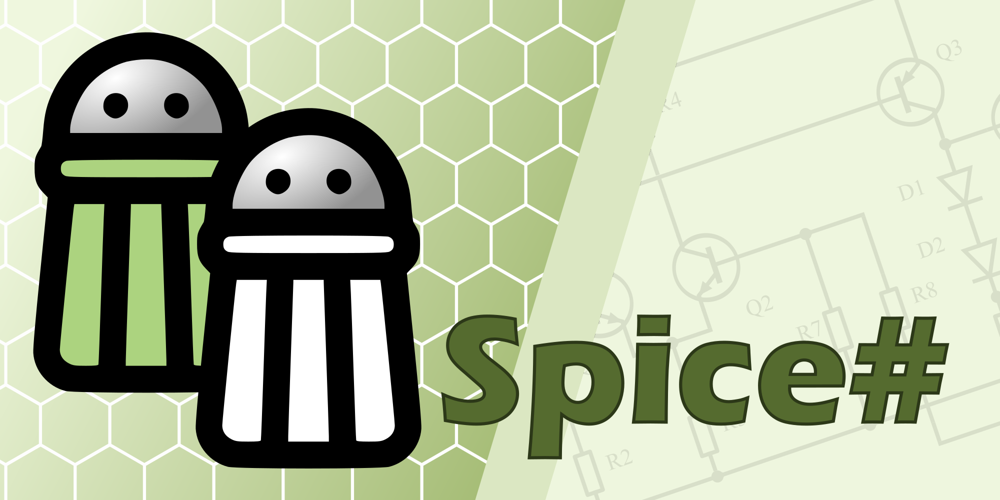

My name is Sven Boulanger, and I'm a Belgian with a wide range of interests. I'm an electronics engineer by trade, more specifically an analog designer with emphasis on silicon and CMOS opto-electronics, device physics.

My other hobbies are - among others - programming, playing badminton, playing music and woodworking. I like finding myself absorbed learning new things.

# Projects

[Spice#](https://github.com/SpiceSharp/SpiceSharp) is a cross-platform circuit simulator written in C#.  The framework should be compatible with models written for Berkeley Spice.

   

### Spice#.Behavioral
The Spice# framework allows extensions, like [Spice#.Behavioral](https://github.com/SpiceSharp/SpiceSharpBehavioral) which is a collection of components that allow behavioral modeling.

   